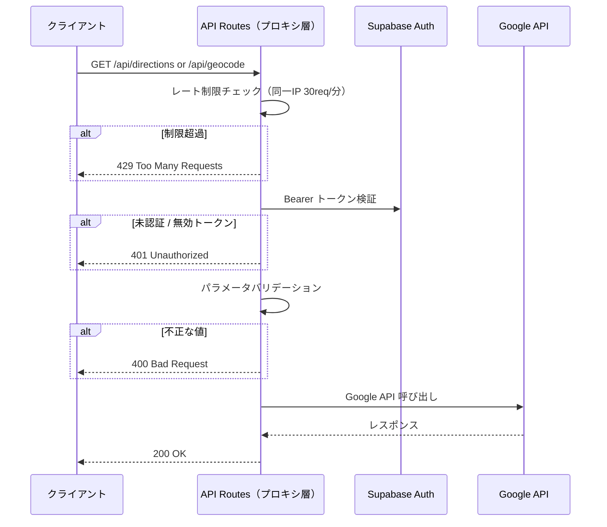

# API設計書

## 共通セキュリティフロー

---

## エンドポイント一覧

| エンドポイント | メソッド | 概要 |
|---|---|---|
| `/api/directions` | GET | 徒歩ルート取得（Google Directions API プロキシ） |
| `/api/geocode` | GET | 住所→座標変換（Google Geocoding API プロキシ） |
| `/api/maps-config` | GET | Google Maps API キーの提供 |

---

## GET /api/directions

### リクエスト（クエリパラメータ）

| パラメータ | 型 | 必須 | バリデーション | 説明 |
|---|---|---|---|---|
| `originLat` | number | ✓ | -90 〜 90 | 出発地の緯度 |
| `originLng` | number | ✓ | -180 〜 180 | 出発地の経度 |
| `destLat` | number | ✓ | -90 〜 90 | 目的地の緯度 |
| `destLng` | number | ✓ | -180 〜 180 | 目的地の経度 |

### レスポンス

| ステータス | 内容 |
|---|---|
| `200` | Google Directions API のレスポンスをそのまま返す |
| `400` | パラメータ不足 / 座標範囲外 / ルート取得失敗 |
| `401` | 未認証 |
| `429` | レート制限超過 |
| `500` | API キー未設定 |

---

## GET /api/geocode

### リクエスト（クエリパラメータ）

| パラメータ | 型 | 必須 | バリデーション | 説明 |
|---|---|---|---|---|
| `address` | string | ✓ | 300 文字以内 | 変換したい住所文字列 |

### レスポンス

| ステータス | 内容 |
|---|---|
| `200` | `{ "latitude": 35.6, "longitude": 139.7 }` |
| `400` | パラメータ不足 / 文字数超過 / 変換失敗 |
| `401` | 未認証 |
| `429` | レート制限超過 |
| `500` | API キー未設定 |

---

## GET /api/maps-config

### レスポンス

| ステータス | 内容 |
|---|---|
| `200` | `{ "apiKey": "..." }` |
| `500` | API キー未設定 |
