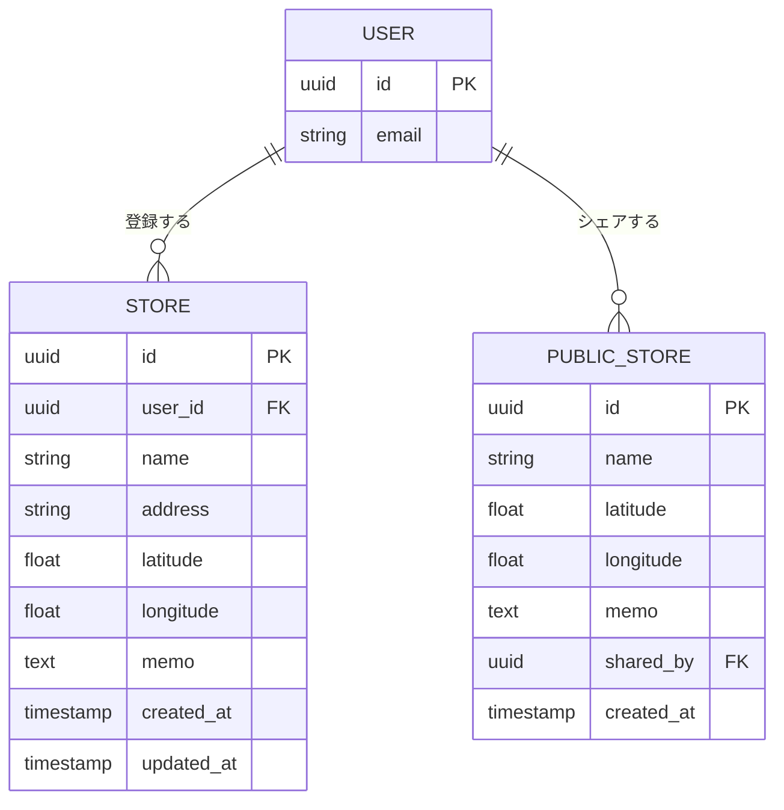

# ER図

```mermaid
erDiagram
    USER {
        uuid id PK
        string email
    }
    STORE {
        uuid id PK
        uuid user_id FK
        string name
        string address
        float latitude
        float longitude
        text memo
        timestamp created_at
        timestamp updated_at
    }
    PUBLIC_STORE {
        uuid id PK
        string name
        float latitude
        float longitude
        text memo
        uuid shared_by FK
        timestamp created_at
    }

    USER ||--o{ STORE : "登録する"
    USER ||--o{ PUBLIC_STORE : "シェアする"
```
