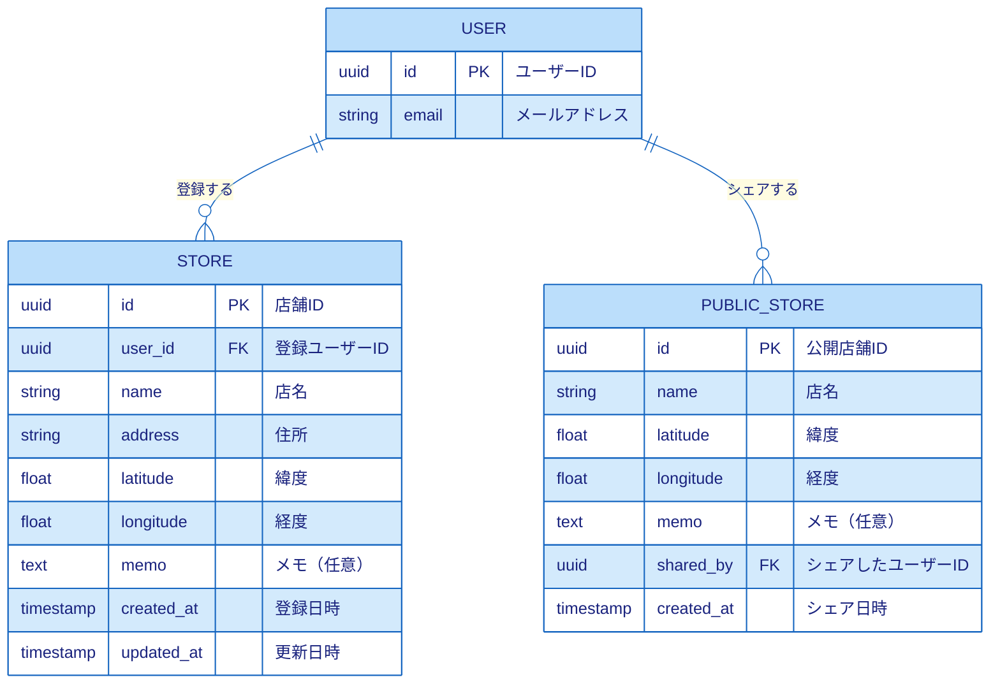

# ER図

```mermaid
%%{init: {'theme': 'base', 'themeVariables': {'primaryColor': '#bbdefb', 'primaryTextColor': '#1a237e', 'primaryBorderColor': '#1565c0', 'lineColor': '#1565c0', 'secondaryColor': '#c8e6c9', 'tertiaryColor': '#fff9c4'}}}%%
erDiagram
    USER {
        uuid      id         PK "ユーザーID"
        string    email         "メールアドレス"
    }
    STORE {
        uuid      id         PK "店舗ID"
        uuid      user_id    FK "登録ユーザーID"
        string    name          "店名"
        string    address       "住所"
        float     latitude      "緯度"
        float     longitude     "経度"
        text      memo          "メモ（任意）"
        timestamp created_at   "登録日時"
        timestamp updated_at   "更新日時"
    }
    PUBLIC_STORE {
        uuid      id         PK "公開店舗ID"
        string    name          "店名"
        float     latitude      "緯度"
        float     longitude     "経度"
        text      memo          "メモ（任意）"
        uuid      shared_by  FK "シェアしたユーザーID"
        timestamp created_at   "シェア日時"
    }

    USER ||--o{ STORE        : "登録する"
    USER ||--o{ PUBLIC_STORE : "シェアする"
```
