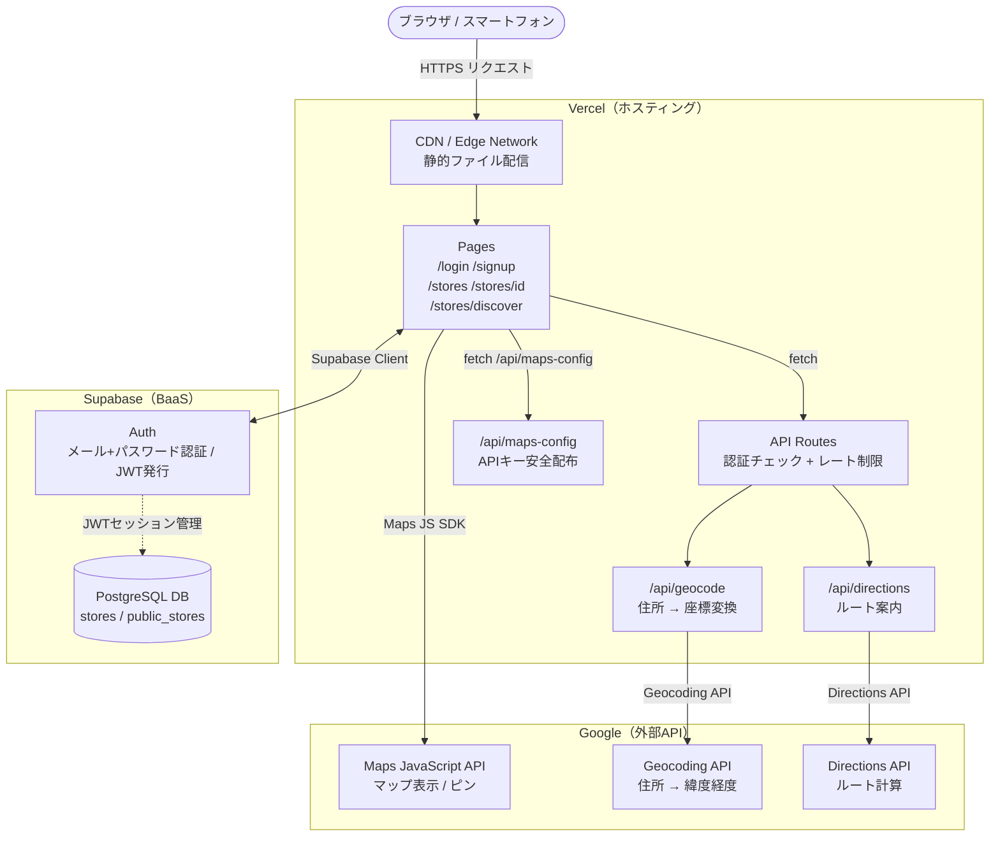

# インフラ構成図

```mermaid
graph TD
    User(["ブラウザ / スマートフォン"])

    subgraph Vercel["Vercel（ホスティング）"]
        CDN["CDN / Edge Network<br/>静的ファイル配信"]
        Pages["Pages<br/>/login  /signup<br/>/stores  /stores/id<br/>/stores/discover"]
        AuthCheck["API Routes<br/>認証チェック + レート制限"]
        Geocode["/api/geocode<br/>住所 → 座標変換"]
        Directions["/api/directions<br/>ルート案内"]
        MapsConfig["/api/maps-config<br/>APIキー安全配布"]
    end

    subgraph Supabase["Supabase（BaaS）"]
        Auth["Auth<br/>メール+パスワード認証 / JWT発行"]
        DB[("PostgreSQL DB<br/>stores / public_stores")]
    end

    subgraph Google["Google（外部API）"]
        MapsJS["Maps JavaScript API<br/>マップ表示 / ピン"]
        GeoAPI["Geocoding API<br/>住所 → 緯度経度"]
        DirAPI["Directions API<br/>ルート計算"]
    end

    User -->|HTTPS リクエスト| CDN
    CDN --> Pages
    Pages -->|fetch| AuthCheck
    Pages -->|fetch /api/maps-config| MapsConfig
    AuthCheck --> Geocode
    AuthCheck --> Directions
    Pages <-->|Supabase Client| Auth
    Auth -. JWTセッション管理 .-> DB
    Pages -->|Maps JS SDK| MapsJS
    Geocode -->|Geocoding API| GeoAPI
    Directions -->|Directions API| DirAPI
```
