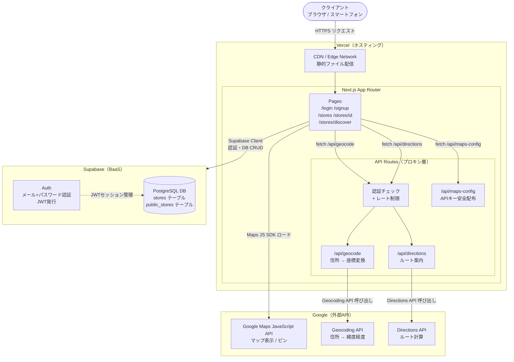

# インフラ構成図

```mermaid
graph TD
    User(["クライアント\nブラウザ / スマートフォン"])
    User -->|HTTPS リクエスト| CDN

    subgraph Vercel["Vercel（ホスティング）"]
        CDN["CDN / Edge Network\n静的ファイル配信"]
        CDN --> Pages

        subgraph AppRouter["Next.js App Router"]
            Pages["Pages\n/login  /signup\n/stores  /stores/id\n/stores/discover"]

            subgraph APIRoutes["API Routes（プロキシ層）"]
                AuthCheck["認証チェック\n+ レート制限"]
                Geocode["/api/geocode\n住所 → 座標変換"]
                Directions["/api/directions\nルート案内"]
                MapsConfig["/api/maps-config\nAPIキー安全配布"]
            end
        end
    end

    Pages -->|fetch /api/geocode| AuthCheck
    Pages -->|fetch /api/directions| AuthCheck
    Pages -->|fetch /api/maps-config| MapsConfig
    AuthCheck --> Geocode
    AuthCheck --> Directions

    subgraph Supabase["Supabase（BaaS）"]
        Auth["Auth\nメール+パスワード認証\nJWT発行"]
        DB[("PostgreSQL DB\nstores テーブル\npublic_stores テーブル")]
        Auth -. JWTセッション管理 .-> DB
    end

    Pages -->|Supabase Client\n認証・DB CRUD| Supabase

    subgraph Google["Google（外部API）"]
        MapsJS["Google Maps JavaScript API\nマップ表示 / ピン"]
        GeoAPI["Geocoding API\n住所 → 緯度経度"]
        DirAPI["Directions API\nルート計算"]
    end

    Pages -->|Maps JS SDK ロード| MapsJS
    Geocode -->|Geocoding API 呼び出し| GeoAPI
    Directions -->|Directions API 呼び出し| DirAPI
```
