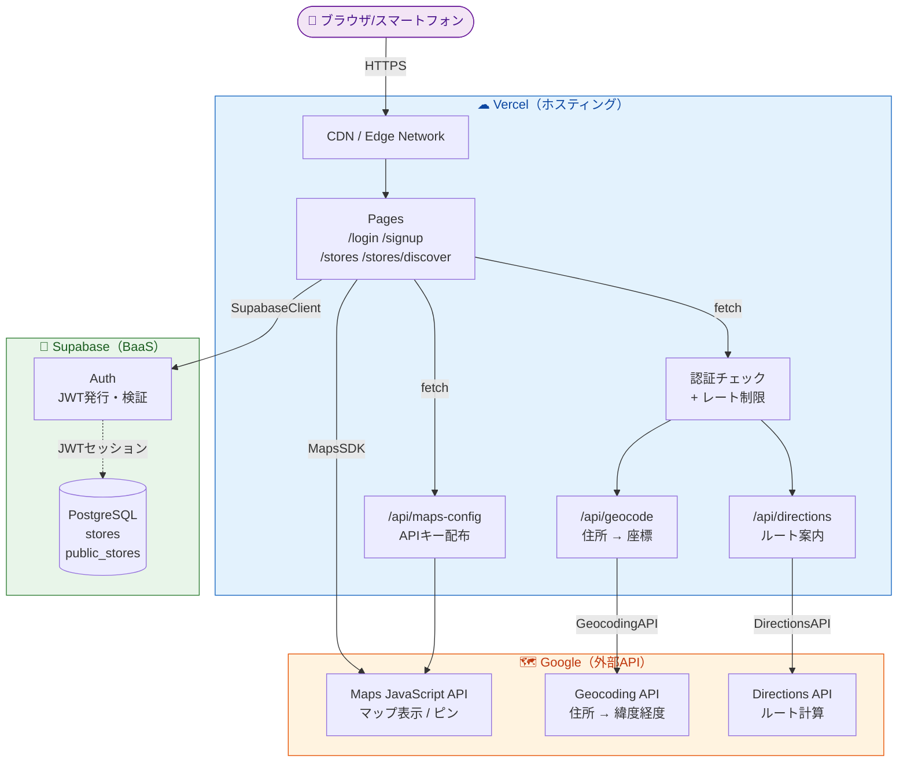

# インフラ構成図

```mermaid
flowchart TD
    User(["👤 ブラウザ/スマートフォン"])

    subgraph vercel["☁ Vercel（ホスティング）"]
        CDN["CDN / Edge Network"]
        Pages["Pages<br/>/login  /signup<br/>/stores  /stores/discover"]
        AuthCheck["認証チェック<br/>+ レート制限"]
        Geocode["/api/geocode<br/>住所 → 座標"]
        Directions["/api/directions<br/>ルート案内"]
        MapsConfig["/api/maps-config<br/>APIキー配布"]
    end

    subgraph supabase["🔐 Supabase（BaaS）"]
        Auth["Auth<br/>JWT発行・検証"]
        DB[("PostgreSQL<br/>stores<br/>public_stores")]
    end

    subgraph google["🗺 Google（外部API）"]
        MapsJS["Maps JavaScript API<br/>マップ表示 / ピン"]
        GeoAPI["Geocoding API<br/>住所 → 緯度経度"]
        DirAPI["Directions API<br/>ルート計算"]
    end

    User      -- HTTPS --> CDN
    CDN       --> Pages
    Pages     -- fetch --> AuthCheck
    Pages     -- fetch --> MapsConfig
    AuthCheck --> Geocode
    AuthCheck --> Directions
    Pages     -- SupabaseClient --> Auth
    Auth      -."JWTセッション".-> DB
    Pages     -- MapsSDK --> MapsJS
    Geocode   -- GeocodingAPI --> GeoAPI
    Directions -- DirectionsAPI --> DirAPI
    MapsConfig --> MapsJS

    style vercel   fill:#e3f2fd,stroke:#1565c0,color:#0d47a1
    style supabase fill:#e8f5e9,stroke:#2e7d32,color:#1b5e20
    style google   fill:#fff3e0,stroke:#e65100,color:#bf360c
    style User     fill:#f3e5f5,stroke:#6a1b9a,color:#4a148c
```
