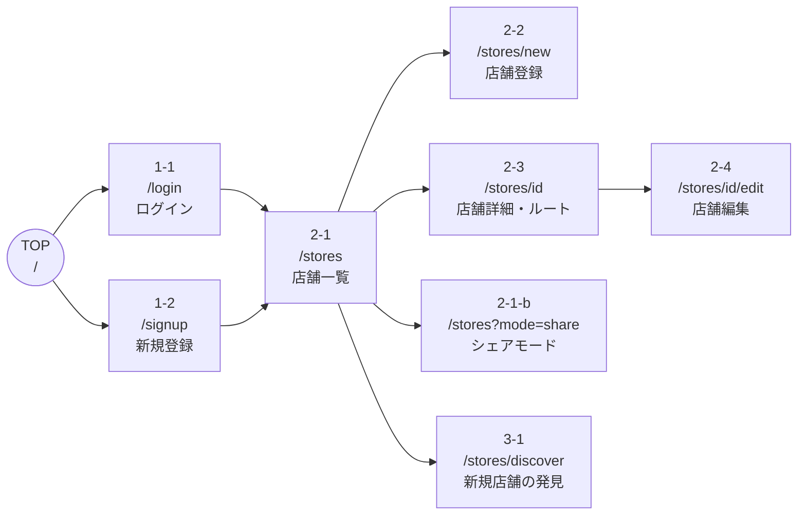

# サイトマップ

```mermaid
flowchart LR
    root(["TOP\n/"])

    root --> login["1-1\n/login\nログイン"]
    root --> signup["1-2\n/signup\n新規登録"]

    login --> stores
    signup --> stores

    stores["2-1\n/stores\n店舗一覧"]
    stores --> new["2-2\n/stores/new\n店舗登録"]
    stores --> detail["2-3\n/stores/id\n店舗詳細・ルート"]
    stores --> share["2-1-b\n/stores?mode=share\nシェアモード"]
    stores --> discover["3-1\n/stores/discover\n新規店舗の発見"]

    detail --> edit["2-4\n/stores/id/edit\n店舗編集"]
```
