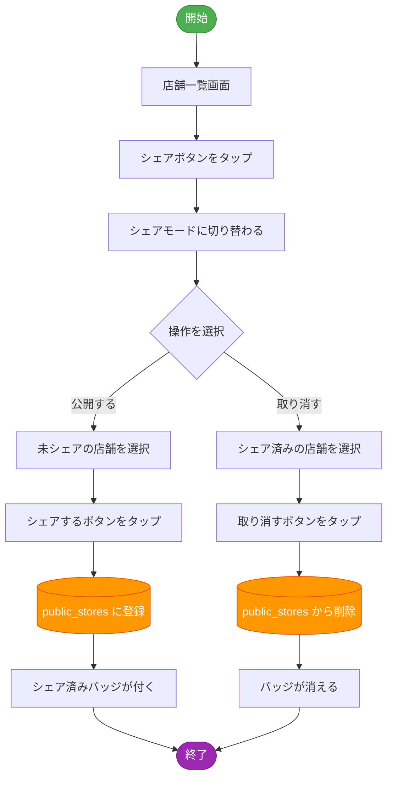
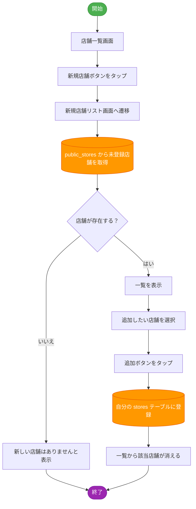

# フローチャート：シェア・新規店舗の発見

## シェア（公開・取り消し）

```mermaid
flowchart TD
    A([開始]):::start --> B[店舗一覧画面]
    B --> C[シェアボタンをタップ]
    C --> D[シェアモードに切り替わる]
    D --> E{操作を選択}

    E -- 公開する --> F[未シェアの店舗を選択]
    F --> G[シェアするボタンをタップ]
    G --> H[(public_stores に登録)]:::db
    H --> I[シェア済みバッジが付く]
    I --> Z([終了]):::terminal

    E -- 取り消す --> K[シェア済みの店舗を選択]
    K --> L[取り消すボタンをタップ]
    L --> M[(public_stores から削除)]:::db
    M --> N[バッジが消える]
    N --> Z

    classDef start    fill:#4caf50,color:#fff,stroke:#388e3c
    classDef terminal fill:#9c27b0,color:#fff,stroke:#7b1fa2
    classDef db       fill:#ff9800,color:#fff,stroke:#e65100
```

## 新規店舗の発見・追加

```mermaid
flowchart TD
    A([開始]):::start --> B[店舗一覧画面]
    B --> C[新規店舗ボタンをタップ]
    C --> D[新規店舗リスト画面へ遷移]
    D --> E[(public_stores から未登録店舗を取得)]:::db
    E --> F{店舗が存在する？}

    F -- いいえ --> G[新しい店舗はありませんと表示]
    G --> Z([終了]):::terminal

    F -- はい --> H[一覧を表示]
    H --> I[追加したい店舗を選択]
    I --> J[追加ボタンをタップ]
    J --> K[(自分の stores テーブルに登録)]:::db
    K --> L[一覧から該当店舗が消える]
    L --> Z

    classDef start    fill:#4caf50,color:#fff,stroke:#388e3c
    classDef terminal fill:#9c27b0,color:#fff,stroke:#7b1fa2
    classDef db       fill:#ff9800,color:#fff,stroke:#e65100
```
