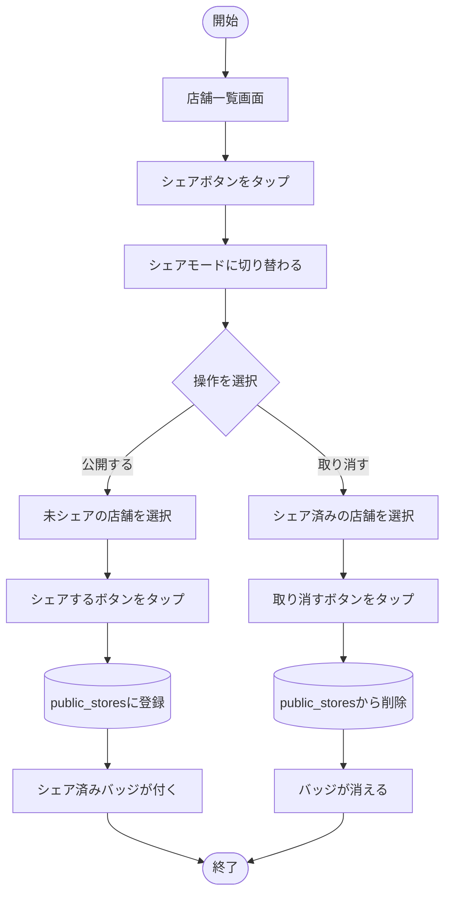

# フローチャート：シェア・新規店舗の発見

## シェア（公開・取り消し）



## 新規店舗の発見・追加

```mermaid
flowchart TD
    A([開始]) --> B[店舗一覧画面]
    B --> C[新規店舗ボタンをタップ]
    C --> D[/stores/discover へ遷移]
    D --> E[(public_storesから未登録店舗を取得)]
    E --> F{店舗が存在する？}

    F -- いいえ --> G[「新しい店舗はありません」を表示]
    G --> Z([終了])

    F -- はい --> H[一覧を表示]
    H --> I[追加したい店舗を選択]
    I --> J[追加ボタンをタップ]
    J --> K[(自分のstoresテーブルに登録)]
    K --> L[一覧から該当店舗が消える]
    L --> Z
```
