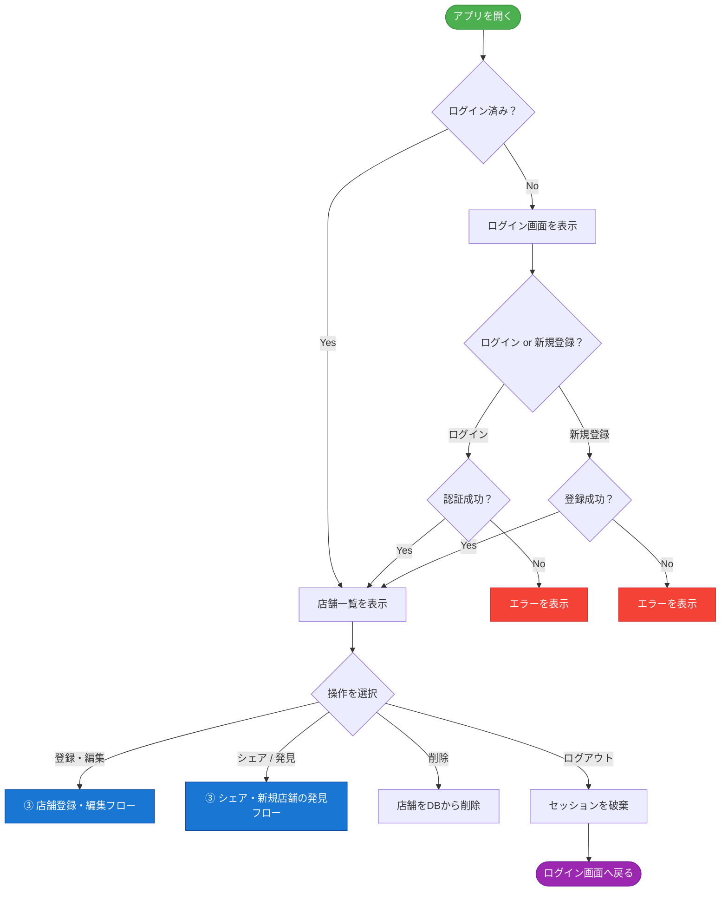

# フローチャート：ログインからの全体図

```mermaid
flowchart TD
    A([アプリを開く]):::start --> B{ログイン済み？}

    B -- Yes --> E[店舗一覧を表示]
    B -- No  --> C[ログイン画面を表示]

    C --> D{ログイン or 新規登録？}

    D -- ログイン   --> D1{認証成功？}
    D1 -- Yes --> E
    D1 -- No  --> ERR1[エラーを表示]:::error

    D -- 新規登録 --> D2{登録成功？}
    D2 -- Yes --> E
    D2 -- No  --> ERR2[エラーを表示]:::error

    E --> F{操作を選択}

    F -- 登録・編集     --> G[③ 店舗登録・編集フロー]:::sub
    F -- シェア / 発見  --> H[③ シェア・新規店舗の発見フロー]:::sub
    F -- 削除           --> I[店舗をDBから削除]
    F -- ログアウト     --> J[セッションを破棄]
    J --> K([ログイン画面へ戻る]):::terminal

    classDef start    fill:#4caf50,color:#fff,stroke:#388e3c
    classDef terminal fill:#9c27b0,color:#fff,stroke:#7b1fa2
    classDef error    fill:#f44336,color:#fff,stroke:#d32f2f
    classDef sub      fill:#1976d2,color:#fff,stroke:#0d47a1
```
