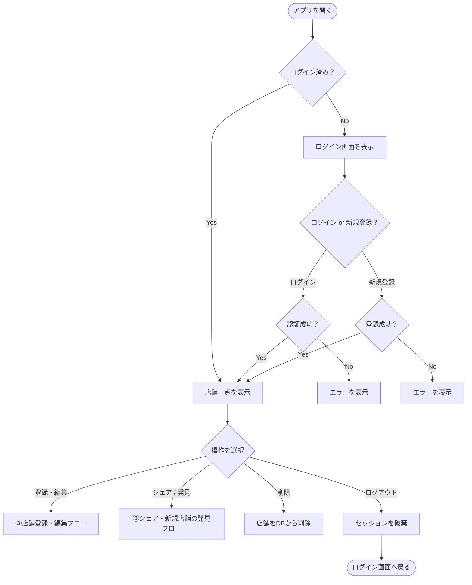

# フローチャート：ログインからの全体図

```mermaid
flowchart TD
    A([アプリを開く]) --> B{ログイン済み？}

    B -- Yes --> E[店舗一覧を表示]
    B -- No --> C[ログイン画面を表示]

    C --> D{ログイン or 新規登録？}

    D -- ログイン --> D1{認証成功？}
    D1 -- Yes --> E
    D1 -- No --> ERR1[エラーを表示]

    D -- 新規登録 --> D2{登録成功？}
    D2 -- Yes --> E
    D2 -- No --> ERR2[エラーを表示]

    E --> F{操作を選択}

    F -- 登録・編集 --> G[③店舗登録・編集フロー]
    F -- シェア / 発見 --> H[③シェア・新規店舗の発見フロー]
    F -- 削除 --> I[店舗をDBから削除]
    F -- ログアウト --> J[セッションを破棄]
    J --> K([ログイン画面へ戻る])
```
