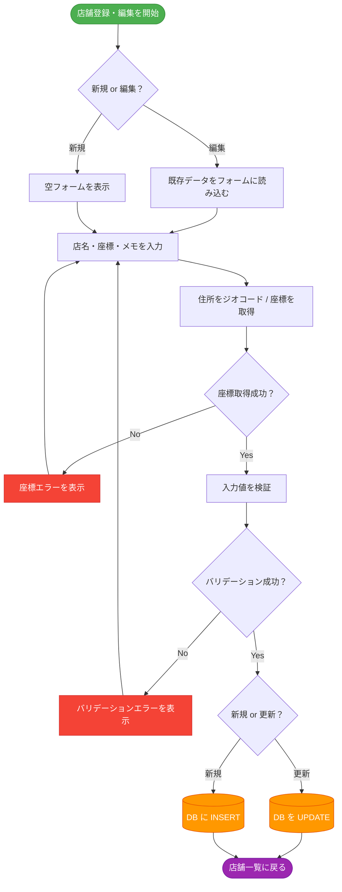

# フローチャート：店舗登録・編集

```mermaid
flowchart TD
    A([店舗登録・編集を開始]):::start --> B{新規 or 編集？}

    B -- 編集 --> C[既存データをフォームに読み込む]
    B -- 新規 --> D[空フォームを表示]

    C --> E[店名・座標・メモを入力]
    D --> E

    E --> F[住所をジオコード / 座標を取得]
    F --> G{座標取得成功？}

    G -- No  --> ERR1[座標エラーを表示]:::error
    ERR1 --> E

    G -- Yes --> H[入力値を検証]
    H --> I{バリデーション成功？}

    I -- No  --> ERR2[バリデーションエラーを表示]:::error
    ERR2 --> E

    I -- Yes --> J{新規 or 更新？}
    J -- 更新 --> K[(DB を UPDATE)]:::db
    J -- 新規 --> L[(DB に INSERT)]:::db
    K --> M([店舗一覧に戻る]):::terminal
    L --> M

    classDef start    fill:#4caf50,color:#fff,stroke:#388e3c
    classDef terminal fill:#9c27b0,color:#fff,stroke:#7b1fa2
    classDef error    fill:#f44336,color:#fff,stroke:#d32f2f
    classDef db       fill:#ff9800,color:#fff,stroke:#e65100
```
