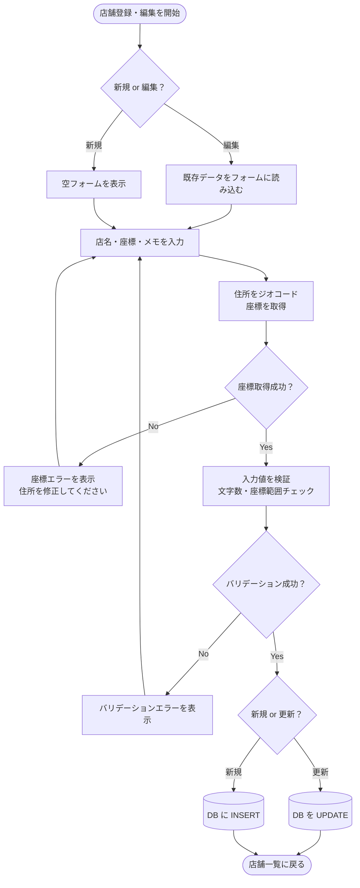

# フローチャート：店舗登録・編集

```mermaid
flowchart TD
    A([店舗登録・編集を開始]) --> B{新規 or 編集？}

    B -- 編集 --> C[既存データをフォームに読み込む]
    B -- 新規 --> D[空フォームを表示]

    C --> E[店名・座標・メモを入力]
    D --> E

    E --> F[住所をジオコード\n座標を取得]
    F --> G{座標取得成功？}

    G -- No --> ERR1[座標エラーを表示\n住所を修正してください]
    ERR1 --> E

    G -- Yes --> H[入力値を検証\n文字数・座標範囲チェック]
    H --> I{バリデーション成功？}

    I -- No --> ERR2[バリデーションエラーを表示]
    ERR2 --> E

    I -- Yes --> J{新規 or 更新？}
    J -- 更新 --> K[(DB を UPDATE)]
    J -- 新規 --> L[(DB に INSERT)]
    K --> M([店舗一覧に戻る])
    L --> M
```
