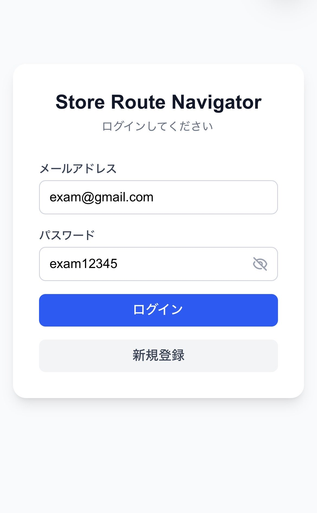

# 1-1. ログイン画面 SP



## ワイヤーフレーム

```
┌─────────────────────────────┐
│                             │
│   ① Store Route Navigator  │
│      ログインしてください    │
│                             │
│   メールアドレス            │
│  ┌───────────────────────┐  │
│  │ ② example@mail.com   │  │
│  └───────────────────────┘  │
│                             │
│   パスワード                │
│  ┌───────────────────────┐  │
│  │ ③ パスワードを入力    │  │
│  └───────────────────────┘  │
│                             │
│  ┌───────────────────────┐  │
│  │    ④ ログイン         │  │
│  └───────────────────────┘  │
│                             │
│  アカウントをお持ちでない方は│
│       ⑤ 新規登録           │
│                             │
└─────────────────────────────┘
```

## 機能詳細

| 番号 | 機能名 | 詳細 | 挙動 | 遷移先 |
|---|---|---|---|---|
| ① | アプリ名・キャッチコピー | アプリ名と「ログインしてください」を表示 | - | - |
| ② | メールアドレス入力 | type=email。必須。プレースホルダー: example@mail.com | テキスト入力 | - |
| ③ | パスワード入力 | type=password。必須。プレースホルダー: パスワードを入力 | テキスト入力（マスク） | - |
| ④ | ログインボタン | Supabase Auth でメール+パスワード認証。失敗時はエラーメッセージをフォーム下に表示 | クリックで認証処理 | 成功: 2-1 店舗一覧 |
| ⑤ | 新規登録リンク | テキストリンク | クリックで遷移 | 1-2 新規登録 |
