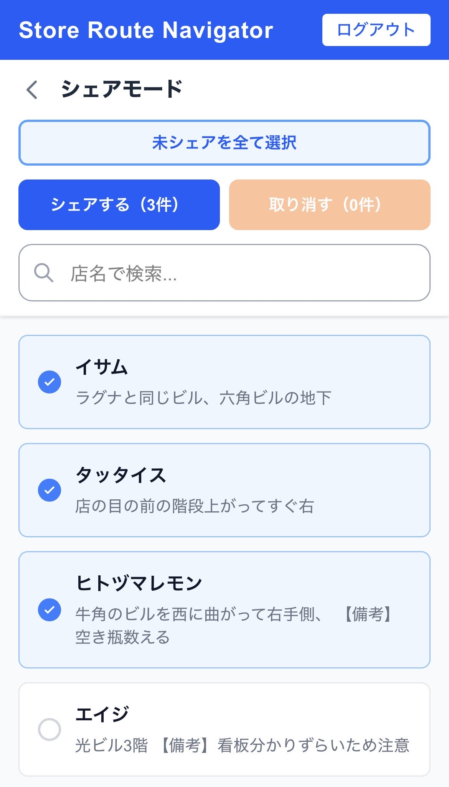

# 2-1-b. シェアモード SP



## ワイヤーフレーム

```
┌─────────────────────────────┐
│ ① Store Route Navigator ログアウト│
├─────────────────────────────┤
│ ② ＜  シェアモード          │
│                             │
│ ┌─────────────────────────┐ │
│ │ ③ 未シェアを全て選択    │ │
│ └─────────────────────────┘ │
│                             │
│ ┌───────────┐┌────────────┐ │
│ │④シェアする││⑤ 取り消す │ │
│ │  （3件）  ││  （0件）   │ │
│ └───────────┘└────────────┘ │
│                             │
│ ┌─────────────────────────┐ │
│ │ 🔍 ⑥ 店名で検索...      │ │
│ └─────────────────────────┘ │
├─────────────────────────────┤
│ ┌─────────────────────────┐ │
│ │ ☑ ⑦ 店舗名             │ │
│ └─────────────────────────┘ │
│ ┌─────────────────────────┐ │
│ │ ☑ ⑦ 店舗名             │ │
│ └─────────────────────────┘ │
│ ┌─────────────────────────┐ │
│ │ ☐ ⑦ 店舗名（未チェック）│ │
│ └─────────────────────────┘ │
│         ・・・               │
└─────────────────────────────┘
```

## 機能詳細

| 番号 | 機能名 | 詳細 | 挙動 | 遷移先 |
|---|---|---|---|---|
| ① | ヘッダー | アプリ名とログアウトボタンを表示 | ログアウトボタンクリックでセッション破棄 | 1-1 ログイン |
| ② | 戻るボタン・タイトル | 「＜」で店舗一覧に戻る。タイトルは「シェアモード」 | クリックで戻る | 2-1 店舗一覧 |
| ③ | 未シェアを全て選択 | まだシェアしていない店舗をすべてチェック状態にする全幅のアウトラインボタン | クリックで未シェア店舗を一括選択 | - |
| ④ | シェアするボタン | 選択中の件数を表示。選択店舗を公開テーブルへ INSERT する。青色ボタン | クリックでシェア処理 → 件数更新 | - |
| ⑤ | 取り消すボタン | 選択中の件数を表示。選択店舗のシェアを公開テーブルから DELETE する。オレンジボタン | クリックで取り消し処理 → 件数更新 | - |
| ⑥ | 検索バー | 店名でリアルタイム絞り込み | テキスト入力で即時フィルタリング | - |
| ⑦ | 店舗カード（チェック付き） | 店舗名を表示。チェックボックスでシェア対象を選択。シェア済み店舗は初期チェック状態 | タップでチェック ON/OFF | - |
