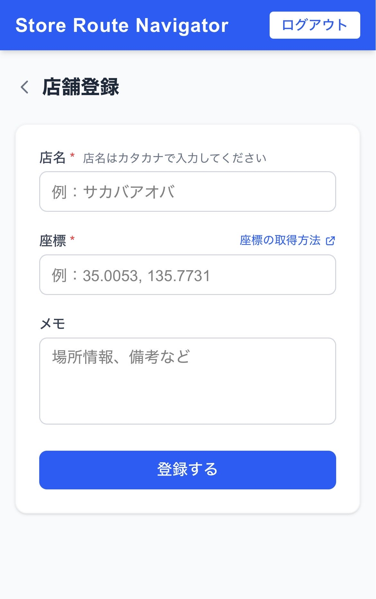

# 2-2. 店舗新規登録 SP



## ワイヤーフレーム

```
┌─────────────────────────────┐
│ Store Route Navigator  ログアウト│
├─────────────────────────────┤
│ ① ＜  店舗登録              │
│                             │
│ ┌─────────────────────────┐ │
│ │  店名 ＊                │ │
│ │ ┌─────────────────────┐ │ │
│ │ │ ② 例：酒場あおば    │ │ │
│ │ └─────────────────────┘ │ │
│ │                         │ │
│ │  座標（Googleマップからコピー）取得方法∨│
│ │ ┌─────────────────────┐ │ │
│ │ │ ③ 例：35.00, 135.77 │ │ │
│ │ └─────────────────────┘ │ │
│ │                         │ │
│ │  住所（座標入力で自動入力）│ │
│ │ ┌─────────────────────┐ │ │
│ │ │ ④ 自動入力          │ │ │
│ │ └─────────────────────┘ │ │
│ │                         │ │
│ │  メモ（任意）           │ │
│ │ ┌─────────────────────┐ │ │
│ │ │                     │ │ │
│ │ │ ⑤ 場所情報など      │ │ │
│ │ │                     │ │ │
│ │ └─────────────────────┘ │ │
│ │                         │ │
│ │ ┌─────────────────────┐ │ │
│ │ │    ⑥ 登録する       │ │ │
│ │ └─────────────────────┘ │ │
│ └─────────────────────────┘ │
└─────────────────────────────┘
```

## 機能詳細

| 番号 | 機能名 | 詳細 | 挙動 | 遷移先 |
|---|---|---|---|---|
| ① | 戻るボタン・タイトル | 「＜」で一覧に戻る。タイトルは「店舗登録」 | クリックで戻る | 2-1 店舗一覧 |
| ② | 店名入力 | 必須。最大100文字。プレースホルダー: 例：酒場あおば | テキスト入力 | - |
| ③ | 座標入力 | 必須。「緯度, 経度」形式。入力確定でジオコードAPIを呼び出し住所を自動取得。「取得方法」タップでヘルプを展開 | テキスト入力 → 住所④へ自動反映 | - |
| ④ | 住所（自動入力） | 座標入力後に Geocoding API で自動取得。読み取り専用 | 自動入力 | - |
| ⑤ | メモ入力 | 任意。最大500文字。プレースホルダー: 場所情報、担当者名など | テキストエリア入力 | - |
| ⑥ | 登録するボタン | バリデーション後に DB へ INSERT。失敗時はエラーをフォーム上部に表示 | クリックで登録処理 | 成功: 2-1 店舗一覧 |
