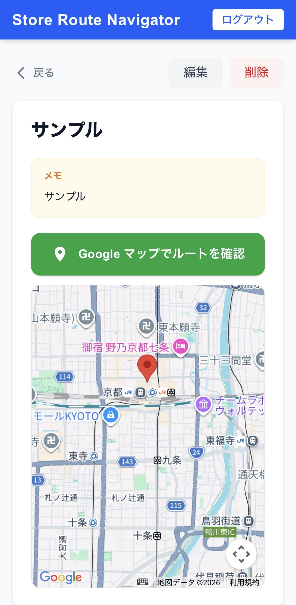

# 2-3. 店舗詳細・ルート表示 SP



## ワイヤーフレーム

```
┌─────────────────────────────┐
│ ① ＜  店舗名               │
├─────────────────────────────┤
│ ② 店舗名        編集  削除 │
│                             │
│ ┌─────────────────────────┐ │
│ │ メモ                    │ │
│ │ ③ メモの内容           │ │
│ └─────────────────────────┘ │
│                             │
│ ┌─────────────────────────┐ │
│ │                         │ │
│ │      ④ Google マップ    │ │
│ │      （ピン表示）        │ │
│ │                         │ │
│ └─────────────────────────┘ │
│                             │
│ ┌─────────────────────────┐ │
│ │ ⑤ ルートを表示          │ │
│ └─────────────────────────┘ │
│                             │
│ ┌─────────────────────────┐ │
│ │ ⑥ 徒歩ルート・所要時間  │ │
│ │   経路ステップ一覧       │ │
│ └─────────────────────────┘ │
└─────────────────────────────┘
```

## 機能詳細

| 番号 | 機能名 | 詳細 | 挙動 | 遷移先 |
|---|---|---|---|---|
| ① | 戻るボタン・タイトル | 「＜」と店舗名を表示 | クリックで戻る | 2-1 店舗一覧 |
| ② | 店舗名・操作ボタン | 店舗名、編集ボタン、削除ボタンを表示。削除は確認ダイアログを表示してから実行 | 編集: 2-4へ遷移。削除: DB から DELETE 後に一覧へ | 編集: 2-4 / 削除後: 2-1 |
| ③ | メモカード | メモが存在する場合のみ表示 | - | - |
| ④ | Google マップ | 店舗の座標にピンを表示。Maps JavaScript API で描画 | - | - |
| ⑤ | ルートを表示ボタン | タップで現在地を取得し Directions API を呼び出す | クリックで位置情報取得 → ルート計算 | - |
| ⑥ | ルート表示エリア | 徒歩所要時間・距離・経路ステップを表示 | Directions API のレスポンスを描画 | - |
