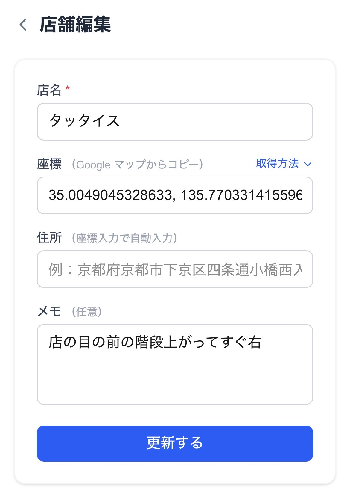

# 2-4. 店舗編集 SP



## ワイヤーフレーム

```
┌─────────────────────────────┐
│ ① ＜  店舗編集              │
│                             │
│ ┌─────────────────────────┐ │
│ │  店名 ＊                │ │
│ │ ┌─────────────────────┐ │ │
│ │ │ ② タッタイス        │ │ │
│ │ └─────────────────────┘ │ │
│ │                         │ │
│ │  座標（Googleマップからコピー）取得方法∨│
│ │ ┌─────────────────────┐ │ │
│ │ │ ③ 35.004, 135.770   │ │ │
│ │ └─────────────────────┘ │ │
│ │                         │ │
│ │  住所（座標入力で自動入力）│ │
│ │ ┌─────────────────────┐ │ │
│ │ │ ④ 自動入力          │ │ │
│ │ └─────────────────────┘ │ │
│ │                         │ │
│ │  メモ（任意）           │ │
│ │ ┌─────────────────────┐ │ │
│ │ │                     │ │ │
│ │ │ ⑤ 既存のメモ内容    │ │ │
│ │ │                     │ │ │
│ │ └─────────────────────┘ │ │
│ │                         │ │
│ │ ┌─────────────────────┐ │ │
│ │ │    ⑥ 更新する       │ │ │
│ │ └─────────────────────┘ │ │
│ └─────────────────────────┘ │
└─────────────────────────────┘
```

## 機能詳細

| 番号 | 機能名 | 詳細 | 挙動 | 遷移先 |
|---|---|---|---|---|
| ① | 戻るボタン・タイトル | 「＜」で詳細に戻る。タイトルは「店舗編集」 | クリックで戻る | 2-3 店舗詳細 |
| ② | 店名入力 | 必須。最大100文字。既存の店名が初期値として入力された状態で表示 | テキスト入力 | - |
| ③ | 座標入力 | 必須。既存の座標が初期値。変更時は住所を再取得。「取得方法」タップでヘルプ展開 | テキスト入力 → 住所④へ自動反映 | - |
| ④ | 住所（自動入力） | 座標変更後に Geocoding API で自動再取得。読み取り専用 | 自動入力 | - |
| ⑤ | メモ入力 | 任意。最大500文字。既存のメモが初期値 | テキストエリア入力 | - |
| ⑥ | 更新するボタン | バリデーション後に DB を UPDATE。失敗時はエラーをフォーム上部に表示 | クリックで更新処理 | 成功: 2-1 店舗一覧 |
