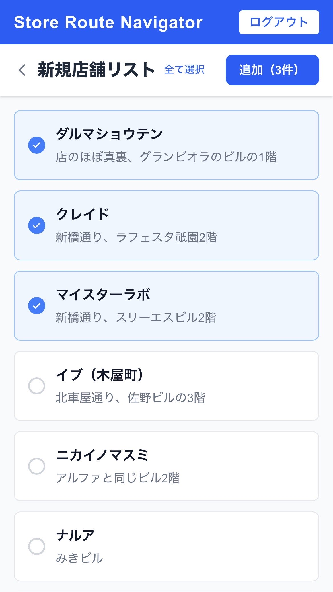

# 3-1. 新規店舗追加（公開店舗リスト）SP



## ワイヤーフレーム

```
┌─────────────────────────────┐
│ ① Store Route Navigator ログアウト│
├─────────────────────────────┤
│ ② ＜ 新規店舗リスト  全て選択 ③│
│                    ④追加（3件）│
│                             │
│ ┌─────────────────────────┐ │
│ │ ☑ ⑤ 店舗名             │ │
│ └─────────────────────────┘ │
│ ┌─────────────────────────┐ │
│ │ ☑ ⑤ 店舗名             │ │
│ └─────────────────────────┘ │
│ ┌─────────────────────────┐ │
│ │ ☑ ⑤ 店舗名             │ │
│ └─────────────────────────┘ │
│ ┌─────────────────────────┐ │
│ │ ☐ ⑤ 店舗名（未チェック）│ │
│ └─────────────────────────┘ │
│         ・・・               │
└─────────────────────────────┘
```

## 機能詳細

| 番号 | 機能名 | 詳細 | 挙動 | 遷移先 |
|---|---|---|---|---|
| ① | ヘッダー | アプリ名とログアウトボタンを表示 | ログアウトボタンクリックでセッション破棄 | 1-1 ログイン |
| ② | 戻るボタン・タイトル | 「＜」で店舗一覧に戻る。タイトルは「新規店舗リスト」 | クリックで戻る | 2-1 店舗一覧 |
| ③ | 全て選択リンク | 一覧に表示されているすべての店舗をチェック状態にするテキストリンク | クリックで全件選択 | - |
| ④ | 追加ボタン | 選択中の件数を表示。選択した公開店舗を自分の店舗一覧へ複製（INSERT）する。青色ボタン | クリックで追加処理 → 成功時は店舗一覧へ遷移 | 成功: 2-1 店舗一覧 |
| ⑤ | 店舗カード（チェック付き） | 他ユーザーが公開した店舗名を表示。チェックボックスで追加対象を選択 | タップでチェック ON/OFF | - |
